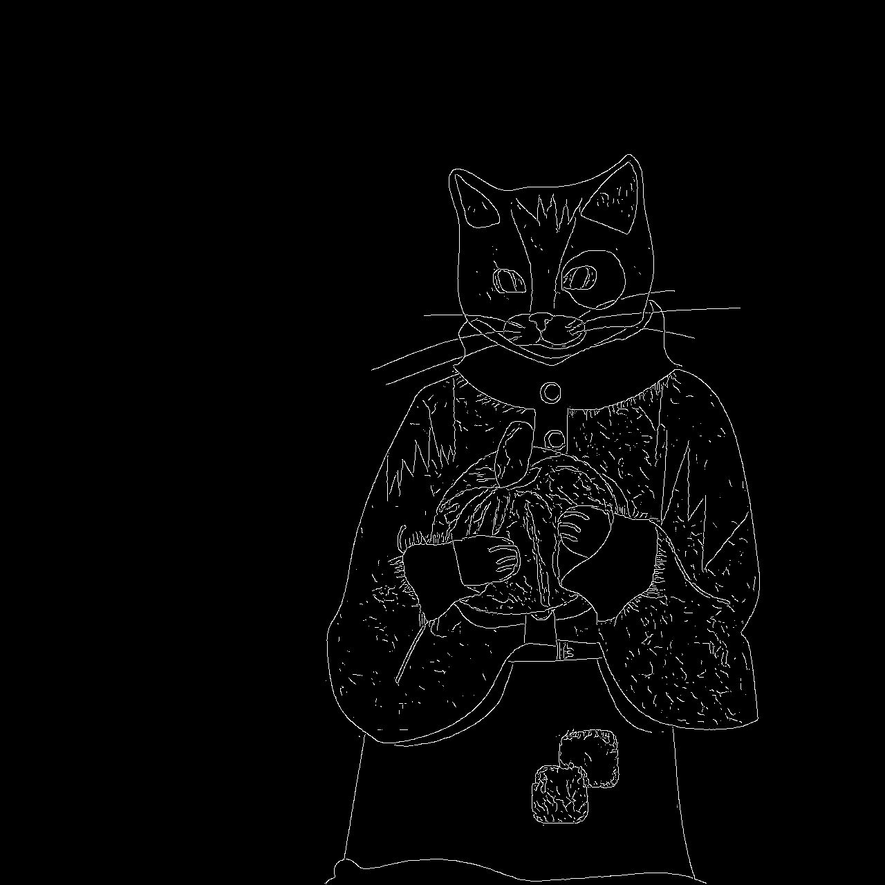

# Harmonic Contour Integration

A compact, fully distributed algorithm that extracts edges from RGB images through four stages:

1. **L0 — pixel harmonic contrast**  
   Each pixel is compared to its eight neighbors in a learned luminance/chroma metric. The result is a per-pixel harmonic field.

2. **L1 — oriented pooling**  
   L0 harmonics are summed over small, overlapping patches on a sparse cell grid. Each cell gets a dominant orientation `θ`.

3. **Seed — facilitation and suppression**  
   Cell responses pass through Naka–Rushton gain control, collinear facilitation along contours, and cross-orientation surround suppression. A divisive readout yields per-cell contour density `ρ`.

4. **Render — ridge back-projection**  
   Cell `ρ` is splatted back to full resolution with learned 1D kernels aligned to local `θ`, producing a soft boundary map. Non-max suppression yields the final edge map.

> **Pre-print:** The paper is included in this repository (`assets/hci.pdf`); the official pre-print release is **awaiting publication** and will be linked here once available.

## Examples

<p align="center">
  
  
</p>

<p align="center"><em>Left: input image. Right: HCI edge map from the bundled pretrained model.</em></p>

## Structure

```
HCI/
├── pyproject.toml
├── requirements.txt
├── params.py                # all hyperparameters
├── train.py                 # HCIE2E training
├── test.py                  # ODS, OIS, AP evaluation
├── infer.py                 # single-image inference + diagnostics
├── hci/
│   ├── L0.py                # pixel-level contrast
│   ├── L1.py                # cell-level z₂ moments (E, C, θ)
│   ├── seed.py              # η_z NR + collinear + surround → cell ρ for splat
│   ├── renderer.py          # learned ridge projection
│   └── diagnostics_viz.py   # visualisation utilities
├── data/                    
│   ├── train/imgs, train/gt # training pairs
│   ├── test/imgs, test/gt   # evaluation pairs
│   └── infer/               # inference images
├── pretrained/
│   └── final.pt             # bundled weights — infer / test without training
└── output/
    ├── checkpoints/         # final.pt, intermediate.pt
    └── test/results.json
```


## Install

Python **3.12+**.

Install everything from `pyproject.toml` / `requirements.txt` (includes CPU `torch` from PyPI).

**uv:**

```bash
uv sync
```

**pip:**

```bash
pip install -r requirements.txt
```

---


### Optional — GPU Acceleration

Check for a Nvidia GPU

```bash
nvidia-smi
```

For CUDA, note the driver version in the output and pick the matching PyTorch index tag (e.g. CUDA 12.8 → `cu128`). See [pytorch.org/get-started](https://pytorch.org/get-started/locally/).

---

1. Install non-torch dependencies (or full sync).
2. Install **CUDA** `torch` from the PyTorch wheel index — use `--reinstall` so it replaces the CPU build from `uv sync`.

**uv:**

```bash
uv sync
uv pip install --reinstall torch --index-url https://download.pytorch.org/whl/cu128
```

**pip:**

```bash
pip install torch --index-url https://download.pytorch.org/whl/cu128
pip install matplotlib>=3.10.8 numpy>=2.0.0 pillow>=12.1.0 pyyaml>=6.0.0 scipy>=1.17.1
```

Replace `cu128` with your tag. Do **not** run `pip install -r requirements.txt` after the CUDA wheel, as that will pin CPU `torch`.

**Verify:**

```bash
uv run python -c "import torch; print(torch.__version__, torch.cuda.is_available())"
```

Expect `True` for the second value on the CUDA path. Training auto-selects `cuda` when available (`device=cuda` in the log); pass `--device cpu` to force CPU.

## Usage

### Inference input layout

`infer.py` takes a **filename** (`-i` / `--image`) and looks for that file under `--input_dir` (default: `data/infer/`):

```
data/infer/
  cat.png          # default location — run with -i cat.png
  photo.jpg
```

Put the image you want to process in `data/infer/`, then pass only its basename:

```bash
uv run infer.py -i cat.png --model pretrained/final.pt
```

If the image lives elsewhere, set `--input_dir` to that folder (path only — still pass the basename with `-i`):

```bash
uv run infer.py -i cat.png --input_dir ~/Pictures --model pretrained/final.pt
# reads ~/Pictures/cat.png
```

Outputs go to `--output_dir` (default: `output/results/`). Add `-d` / `--diagnostics` for pinwheel, ρ maps, and overlay PNGs; add `-v` / `--verbose` to print learned parameters.

### Pretrained model

A pretrained checkpoint is included at `pretrained/final.pt` (learned L0 metric, seed, renderer). Use it to run **infer** or **test** without training your own weights:

```bash
# inference (image in data/infer/ by default)
uv run infer.py -i cat.png --model pretrained/final.pt

# evaluation on a paired test set
uv run test.py --images data/test/imgs --test_gt data/test/gt --model pretrained/final.pt
```

Training still writes new checkpoints under `output/checkpoints/`; pass `--model` to point at those instead.

### Train

```bash
uv run train.py --train_imgs data/train/imgs --train_gt data/train/gt
```

Main flags: `--epochs`, `--lr` (default `5e-2`), `--batch_size`, `--max_val_ratio`, `--device`, `--output_dir`, `--checkpoints_dir`, `--cache_dir`, `--gt_format` (`png` / `mat`; auto-detected from GT dir if omitted).

### BIPED

`BIPED/` is in `.gitignore`, place the dataset at the repo root yourself. Training uses `train.py` with the train RGB and edge-map folders below. Layout expected by the default commands (RGB + PNG edge maps):

```
BIPED/edges/imgs/train/rgbr/real/           # training RGB (.jpg / .png)
BIPED/edges/edge_maps/train/rgbr/real/      # training GT edges (same stem per image)
BIPED/edges/imgs/test/rgbr/                 # test RGB
BIPED/edges/edge_maps/test/rgbr/            # test GT edges
```

If you have the Kaggle CLI set up (or you already downloaded/unzipped the dataset), you can generate this layout with:

```bash
sh scripts/biped.sh --version bipedv2 --kaggle   # recommended
# or: sh scripts/biped.sh --version biped --src-dir /path/to/extracted/BIPED
# optional: --data-root BIPEDv2
```

**Train** on the BIPED train split (writes checkpoints under `output/checkpoints` unless overridden):

```bash
uv run train.py \
  --train_imgs BIPED/edges/imgs/train/rgbr/real \
  --train_gt BIPED/edges/edge_maps/train/rgbr/real \
  --cache_dir cache/biped_train \
```

Use a dedicated `--cache_dir` so BIPED caches do not mix with other experiments. Lower `--batch_size` if you hit GPU memory limits.

**Test** on the BIPED test split (ODS / OIS / AP; pairs images to GT by filename stem):

```bash
uv run test.py \
  --images BIPED/edges/imgs/test/rgbr \
  --test_gt BIPED/edges/edge_maps/test/rgbr \
  --output_dir output/test_biped
```

Quick smoke test: add `--max_images 10`. If your GT folder uses BSDS-style `.mat` files instead of PNG, pass `--gt_format mat`.

### BRIND (edge maps)

BRIND is a BSDS-based edge benchmark annotated for different discontinuity types (reflectance, illuminance, normal, depth) plus a combined `all` edge map.

To remap BRIND into the HCI directory layout used by `train.py`/`test.py`:

```bash
sh scripts/brind.sh --src-dir /path/to/extracted/BRIND --data-root BRIND --gt-type all
```

**Train** on BRIND (combined `all` edges by default):

```bash
uv run train.py \
  --train_imgs BRIND/edges/imgs/train/rgbr/real \
  --train_gt BRIND/edges/edge_maps/train/rgbr/real \
  --cache_dir cache/brind_train
```

**Test** on BRIND:

```bash
uv run test.py \
  --images BRIND/edges/imgs/test/rgbr \
  --test_gt BRIND/edges/edge_maps/test/rgbr \
  --output_dir output/test_brind
```

If the ground truth maps are stored as `.mat` files in your BRIND extraction, pass `--gt_format mat` to `test.py` and `--gt_format mat` to `train.py`.

### BSDS500

Clone the mirror at the repo root (e.g. next to this project): [BIDS/BSDS500](https://github.com/BIDS/BSDS500).

```bash
git clone https://github.com/BIDS/BSDS500.git
```

Paths below assume the usual layout inside the clone: `BSDS500/BSDS500/data/images/{train,test}` and `BSDS500/BSDS500/data/groundTruth/{train,test}`.

**Train** on the BSDS500 train split (MAT ground truth):

```bash
uv run train.py \
  --train_imgs BSDS500/BSDS500/data/images/train \
  --train_gt BSDS500/BSDS500/data/groundTruth/train \
  --gt_format mat \
  --cache_dir cache/bsds_train \
```

Use a dedicated `--cache_dir` so BSDS caches do not mix with BIPED or other runs. Lower `--batch_size` if you run out of memory.

**Test** on the BSDS500 test split (MAT ground truth):

```bash
uv run test.py \
  --images BSDS500/BSDS500/data/images/test \
  --test_gt BSDS500/BSDS500/data/groundTruth/test \
  --gt_format mat \
  --output_dir output/test_bsds500
```


### NYUD v2 (edge maps)

NYUD v2 is primarily an RGB-D dataset, but it is often used for edge detection through derived edge annotations. HCI matches RGB images and GT by filename stem (for example `img_5001.png` in both folders).

Default layout after running `nyud.sh`:

```
NYUDv2/
  images/                            # RGB images (.jpg / .png)
  GT/                                # edge GT maps (.png)
```

**Train** on the downloaded NYUDv2 layout (writes checkpoints under `output/checkpoints` unless overridden):

```bash
uv run train.py \
  --train_imgs NYUDv2/images \
  --train_gt NYUDv2/GT \
  --cache_dir cache/nyudv2_train
```

Use a dedicated `--cache_dir` so NYUD caches do not mix with other experiments. Lower `--batch_size` if you hit GPU memory limits.

**Test** on the downloaded NYUDv2 layout:

```bash
uv run test.py \
  --images NYUDv2/images \
  --test_gt NYUDv2/GT \
  --output_dir output/test_nyudv2
```

Quick smoke test: add `--max_images 20`.

If your NYUD edge labels are stored as MAT files, add `--gt_format mat`.

Optional split-based layout (if you create your own train/test split):

```
NYUDv2/
  images/train/
  images/test/
  edges/train/
  edges/test/
```

Use the corresponding split paths with `train.py` and `test.py`.

### Test

Walks a single image directory, pairs each image with ground truth by matching filename stems:

```bash
uv run test.py --model output/checkpoints/final.pt
```


| Flag           | Default                       | Role                                                              |
| -------------- | ----------------------------- | ----------------------------------------------------------------- |
| `--images`     | `data/test/imgs`              | RGB test images (`.jpg`/`.png`)                                   |
| `--test_gt`    | `data/test/gt`                | Ground truth maps (`.png`/`.jpg`/`.mat`)                          |
| `--gt_format`  | auto                          | `png` or `mat` (BSDS)                                             |
| `--model`      | `output/checkpoints/final.pt` | Checkpoint                                                        |
| `--output_dir` | `output/test`                 | Output directory                                                  |
| `--max_images` | all                           | Cap number of images                                              |
| `--device`     | CUDA if available             | `cpu`, `cuda`, or `mps`                                           |
| `--tol`        | `0.0075`                      | Precision-match radius factor (`max_dist = tol * image_diagonal`) |


### Infer

Single-image edge detection. Resolves the input as `{input_dir}/{image}` (see [Inference input layout](#inference-input-layout) above).

```bash
# default: data/infer/photo.png → output/results/
uv run infer.py -i photo.png --model pretrained/final.pt

# custom input folder + diagnostics
uv run infer.py -i photo.png --input_dir /path/to/images \
  --model output/checkpoints/final.pt -d -v
```

| Flag           | Default                       | Role                                                              |
| -------------- | ----------------------------- | ----------------------------------------------------------------- |
| `-i`, `--image`| *(required)*                  | Image filename (resolved under `--input_dir`)                     |
| `--input_dir`  | `data/infer`                  | Folder containing the input image                                 |
| `--model`      | `output/checkpoints/intermediate.pt` | Checkpoint                                                 |
| `--output_dir` | `output/results`              | Where edge PNGs (and diagnostics) are written                     |
| `-d`, `--diagnostics` | off                    | Save pinwheel, ρ maps, geometry, overlay, etc.                    |
| `-t`, `--threshold` | `0.5`                     | Binarization threshold on the soft boundary map                   |
| `--ridge-nms`  | on                            | Directional NMS along renderer θ; use `--no-ridge-nms` for raw map |
| `--device`     | CUDA if available             | `cpu`, `cuda`, or `mps`                                           |