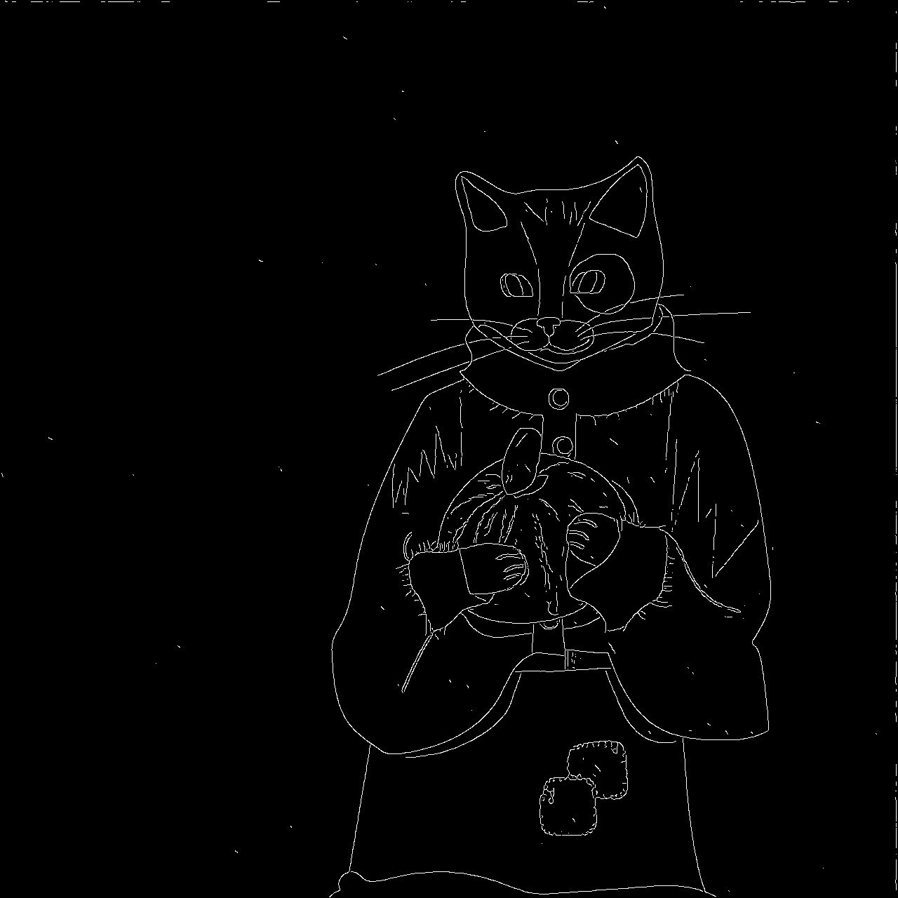

# Harmonic Contour Integration

A compact, fully distributed algorithm that extracts edges from RGB images through four stages:

1. **L0 — pixel harmonic contrast**  
   Each pixel is compared to its eight neighbors in a learned luminance/chroma metric. The result is a per-pixel harmonic field.

2. **L1 — oriented pooling**  
   L0 harmonics are summed over small, overlapping patches on a sparse cell grid. Each cell gets a dominant orientation `θ`.

3. **Seed — facilitation and suppression**  
   Cell responses pass through Naka–Rushton gain control, collinear support along contours, cross-scale support, and cross-orientation surround suppression. Collinear support scales each cell's own response and bridges gaps that have support on both sides. Cross-scale support re-runs L0 and L1 on the image pooled 2× and 4×, and strengthens a cell when the same orientation responds at those coarser scales. A divisive readout yields per-cell contour density `ρ`.

4. **Render — ridge back-projection**  
   Cell `ρ` is splatted back to full resolution with learned 1D kernels aligned to local `θ`, producing a soft boundary map. Non-max suppression yields the final edge map.

> **Paper:** [HCI: Harmonic Contour Integration for Edge Detection](https://zenodo.org/records/21382933) — DOI [10.5281/zenodo.21382933](https://doi.org/10.5281/zenodo.21382933). A copy is also bundled in this repository (`assets/hci.pdf`).

## Examples

<p align="center">
  
  
</p>

<p align="center"><em>Left: input image. Right: HCI edge map from the bundled pretrained model.</em></p>

## Benchmarks

Scores for `pretrained/final.pt` on the BRIND test set (200 images; the model was trained on the 300-image BRIND train split). Evaluation uses the Berkeley boundary benchmark: 99 thresholds and `maxDist` 0.0075 (≈4.3 px on 481×321 images). Predictions are thinned before one-to-one matching; see [Test](#test).

| Output | ODS | OIS | AP |
| --- | --- | --- | --- |
| NMS-thinned map (`s_eval`) | 0.6915 | 0.7180 | 0.7197 |
| Raw soft map (`c_eval`) | 0.6900 | 0.7151 | 0.5941 |

## Structure

```
HCI/
├── pyproject.toml
├── requirements.txt
├── params.py                # all hyperparameters
├── train.py                 # HCIE2E training
├── test.py                  # ODS, OIS, AP evaluation
├── infer.py                 # single-image inference + diagnostics
├── scripts/                 # biped.sh, brind.sh, nyud.sh — fetch and lay out datasets
├── hci/
│   ├── L0.py                # pixel-level contrast
│   ├── L1.py                # cell-level z₂ moments (E, C, θ)
│   ├── seed.py              # η_z NR + collinear + cross-scale + surround → cell ρ for splat
│   ├── renderer.py          # learned ridge projection
│   ├── boundary_bench.py    # Berkeley boundary benchmark (ODS, OIS, AP)
│   ├── cli.py               # `uv run train` / `test` / `infer` entry points
│   └── diagnostics_viz.py   # visualisation utilities
├── data/                    # BRIND, the default dataset (scripts/brind.sh)
│   ├── train/imgs, train/gt # 300 training pairs
│   └── test/imgs, test/gt   # 200 evaluation pairs
├── BIPED/, NYUDv2/          # other datasets, same {train,test}/{imgs,gt} layout (scripts/)
├── pretrained/
│   └── final.pt             # bundled weights — infer / test without training
└── output/
    ├── checkpoints/         # final.pt, intermediate.pt
    └── test/{c_eval,s_eval}/ # results.json, eval_bdry*.txt, preds/
```


## Install

Python **3.12+**.

Install everything from `pyproject.toml` / `requirements.txt` (includes CPU `torch` from PyPI).

**uv:**

```bash
uv sync
```

**pip:**

```bash
pip install -r requirements.txt
```

---


### Optional — GPU Acceleration

Check for a Nvidia GPU

```bash
nvidia-smi
```

For CUDA, note the driver version in the output and pick the matching PyTorch index tag (e.g. CUDA 12.8 → `cu128`). See [pytorch.org/get-started](https://pytorch.org/get-started/locally/).

---

1. Install non-torch dependencies (or full sync).
2. Install **CUDA** `torch` from the PyTorch wheel index — use `--reinstall` so it replaces the CPU build from `uv sync`.

**uv:**

```bash
uv sync
uv pip install --reinstall torch --index-url https://download.pytorch.org/whl/cu128
```

**pip:**

```bash
pip install torch --index-url https://download.pytorch.org/whl/cu128
pip install matplotlib>=3.10.8 numpy>=2.0.0 pillow>=12.1.0 pyyaml>=6.0.0 scipy>=1.17.1
```

Replace `cu128` with your tag. Do **not** run `pip install -r requirements.txt` after the CUDA wheel, as that will pin CPU `torch`.

**Verify:**

```bash
uv run python -c "import torch; print(torch.__version__, torch.cuda.is_available())"
```

Expect `True` for the second value on the CUDA path. Training auto-selects `cuda` when available (`device=cuda` in the log); pass `--device cpu` to force CPU.

## Usage

`uv run train`, `uv run test` and `uv run infer` run `train.py`, `test.py` and `infer.py` from the repo root. Without uv, run the scripts directly (`python test.py ...`) with the same flags.

### Inference input

`infer` takes the path to the image with `-i` / `--image`:

```bash
uv run infer -i assets/base.png
uv run infer -i ~/Pictures/photo.jpg
```

Outputs go to `--output_dir` (default: `output/results/`). Add `-d` / `--diagnostics` for pinwheel, ρ maps, and overlay PNGs; add `-v` / `--verbose` to print learned parameters.

### Pretrained model

A pretrained checkpoint is included at `pretrained/final.pt` (learned L0 metric, seed, renderer). It's the default `--model` for **infer** and **test**, so you can run them without training your own weights. `test` and `train` default to BRIND in `data/`, which `scripts/brind.sh` creates:

```bash
# inference
uv run infer -i assets/base.png

# evaluation on the BRIND test set
sh scripts/brind.sh
uv run test
```

Training still writes new checkpoints under `output/checkpoints/`; pass `--model` to point at those instead.

### Train

Trains on BRIND in `data/train` by default:

```bash
uv run train
```

Main flags: `--train_imgs`, `--train_gt`, `--gt_format` (`png` / `mat`; auto-detected from the GT folder if omitted), `--epochs` (default `20`), `--lr` (default `5e-2`), `--batch_size`, `-n` (cap the number of images), `--device`, `--output_dir`, `--checkpoints_dir`, `--cache_dir`, `--num_workers`, `--grad_clip`, `--gt_min_agreement`, `--resume`. `--debug-seed` runs one batch and prints the seed's parameters and gradients.

Each epoch overwrites `intermediate.pt` in `--checkpoints_dir` with the weights, optimizer state, epoch number and loss history. To continue an interrupted run, repeat the command with `--resume`:

```bash
uv run train --resume
```

`--resume` reads `intermediate.pt` from `--checkpoints_dir`; pass a path (`--resume other.pt`) to use another checkpoint. Training picks up at the next epoch and runs to `--epochs`, with the learning rate taken from the cosine schedule for the current `--lr` and `--epochs`. A checkpoint that holds only weights, such as `final.pt`, is used as the starting point for a full run from epoch 1.

Training also uses coarser scales. `SEED.SCALES` in `params.py` lists the pooling factors, `(2, 4)` by default, and training learns one gain per scale. Set it to `()` to train at full resolution only. A checkpoint records the scales it was trained with, so `test` and `infer` follow whichever checkpoint they load.

### BIPED

BIPED has 250 outdoor 1280×720 images with expert edge annotations: 200 train, 50 test. `scripts/biped.sh` writes (`BIPED/` is in `.gitignore`):

```
BIPED/train/imgs/   # 200 RGB images (.jpg)
BIPED/train/gt/     # 200 edge maps (.png, same stem)
BIPED/test/imgs/    # 50 RGB images
BIPED/test/gt/      # 50 edge maps
```

`--kaggle` downloads [xavysp/biped](https://www.kaggle.com/datasets/xavysp/biped) with the Kaggle CLI, run through `uvx`. It needs a Kaggle API token in `~/.kaggle/kaggle.json`, or `KAGGLE_USERNAME` and `KAGGLE_KEY`. If you downloaded BIPED yourself, pass the folder with `--src-dir`; when it contains both BIPED and BIPEDv2, v2 is used.

```bash
sh scripts/biped.sh --kaggle
# or: sh scripts/biped.sh --src-dir /path/to/downloaded/BIPED
# optional: --data-root DIR (default: BIPED)
```

**Train** on the BIPED train split (writes checkpoints under `output/checkpoints` unless overridden):

```bash
uv run train \
  --train_imgs BIPED/train/imgs \
  --train_gt BIPED/train/gt \
  --cache_dir cache/biped_train
```

Use a dedicated `--cache_dir` so BIPED caches do not mix with other experiments. Lower `--batch_size` if you hit GPU memory limits.

**Test** on the BIPED test split (ODS / OIS / AP; pairs images to GT by filename stem):

```bash
uv run test \
  --dataset BIPED \
  --images BIPED/test/imgs \
  --test_gt BIPED/test/gt \
  --output_dir output/test_biped
```

Quick smoke test: add `-n 10`.

### BRIND (edge maps)

BRIND is BSDS500 re-annotated at the edge level by [RINDNet](https://github.com/MengyangPu/RINDNet) for four discontinuity types: reflectance, illumination, normal and depth. The published [BRIND](https://github.com/xavysp/BRIND) set merges them into one edge map per image, 300 train / 200 test. The per-type maps are only available from RINDNet.

BRIND is the default dataset. `scripts/brind.sh` clones it into `data/`, where `train` and `test` look when no paths are given:

```
data/train/imgs/   # 300 RGB images (.jpg)
data/train/gt/     # 300 edge maps (.png, same stem)
data/test/imgs/    # 200 RGB images
data/test/gt/      # 200 edge maps
```

```bash
sh scripts/brind.sh
# or, from an existing clone: sh scripts/brind.sh --src-dir /path/to/BRIND
# optional: --data-root DIR (default: data)
```

**Train** and **test** on BRIND:

```bash
uv run train
uv run test
```

### BSDS500

Clone the mirror at the repo root (e.g. next to this project): [BIDS/BSDS500](https://github.com/BIDS/BSDS500).

```bash
git clone https://github.com/BIDS/BSDS500.git
```

Paths below assume the usual layout inside the clone: `BSDS500/BSDS500/data/images/{train,test}` and `BSDS500/BSDS500/data/groundTruth/{train,test}`.

**Train** on the BSDS500 train split (MAT ground truth):

```bash
uv run train \
  --train_imgs BSDS500/BSDS500/data/images/train \
  --train_gt BSDS500/BSDS500/data/groundTruth/train \
  --gt_format mat \
  --cache_dir cache/bsds_train
```

Use a dedicated `--cache_dir` so BSDS caches do not mix with BIPED or other runs. Lower `--batch_size` if you run out of memory.

**Test** on the BSDS500 test split (MAT ground truth):

```bash
uv run test \
  --dataset BSDS500 \
  --images BSDS500/BSDS500/data/images/test \
  --test_gt BSDS500/BSDS500/data/groundTruth/test \
  --gt_format mat \
  --output_dir output/test_bsds500
```


### NYUD v2 (edge maps)

NYUD v2 is an RGB-D dataset. Edge detection uses the ground truth that [Gupta et al.](https://github.com/s-gupta/rcnn-depth) released for its 1449 labelled images: 795 train+val and 654 test. `scripts/nyud.sh` downloads their release (`eccv14-data.tgz`, about 900 MB) and writes:

```
NYUDv2/train/imgs/   # 795 RGB images (img_XXXX.png)
NYUDv2/train/gt/     # ground truth, one BSDS-format groundTruth .mat per image
NYUDv2/test/imgs/    # 654 RGB images
NYUDv2/test/gt/
```

```bash
sh scripts/nyud.sh
# or, from an extracted copy: sh scripts/nyud.sh --src-dir /path/to/eccv14-data
# optional: --data-root DIR (default: NYUDv2)
```

**Train** on the NYUD train split (`.mat` ground truth is detected automatically):

```bash
uv run train \
  --train_imgs NYUDv2/train/imgs \
  --train_gt NYUDv2/train/gt \
  --cache_dir cache/nyudv2_train
```

Use a dedicated `--cache_dir` so NYUD caches do not mix with other experiments. Lower `--batch_size` if you hit GPU memory limits.

**Test** on the NYUD test split. NYUD results are reported with a matching distance of `0.011`, looser than BSDS's `0.0075`, because its ground truth is less precisely localised:

```bash
uv run test \
  --dataset NYUDv2 \
  --images NYUDv2/test/imgs \
  --test_gt NYUDv2/test/gt \
  --tol 0.011 \
  --output_dir output/test_nyudv2
```

Quick smoke test: add `-n 20`.

### Test

Walks a single image directory, pairs each image with ground truth by matching filename stems, and scores both the raw map (`c_eval`) and the NMS-thinned map (`s_eval`) with the Berkeley boundary benchmark. Without path flags it evaluates BRIND in `data/test`:

```bash
uv run test --model output/checkpoints/final.pt
```

The protocol follows the Berkeley benchmark (`hci/boundary_bench.py`). At each of `--nthresh` thresholds, the saved 8-bit prediction is binarised and thinned (`bwmorph(·, 'thin', inf)`). It is then matched one-to-one against each annotator within `tol × image diagonal` pixels. ODS interpolates between thresholds, OIS uses each image's best threshold, and AP is the area under the PR curve resampled at 0.01 recall. Each annotator in a `.mat` file is matched separately; BSDS500 has about five per image. A PNG ground-truth map counts as a single annotator. Scores from earlier versions of `test.py`, which used a dilation match, are not comparable.

| Flag           | Default                       | Role                                                              |
| -------------- | ----------------------------- | ----------------------------------------------------------------- |
| `--dataset`    | `BRIND`                       | Dataset name shown in the report and `results.json`               |
| `--images`     | `data/test/imgs`              | RGB test images (`.jpg`/`.png`)                                   |
| `--test_gt`    | `data/test/gt`                | Ground truth maps (`.png`/`.jpg`/`.mat`)                          |
| `--gt_format`  | auto                          | `png` or `mat` (BSDS)                                             |
| `--model`      | `pretrained/final.pt`         | Checkpoint                                                        |
| `--output_dir` | `output/test`                 | Output directory                                                  |
| `-n`           | all                           | Cap number of images                                              |
| `--device`     | CUDA if available             | `cpu`, `cuda`, or `mps`                                           |
| `--diagnostics`| off                           | Save ρ and geometry maps per image under `output_dir/diagnostics/` |
| `--tol`        | `0.0075`                      | Matching distance as a fraction of the image diagonal (NYUD convention: `0.011`) |
| `--nthresh`    | `99`                          | Number of thresholds                                              |
| `--workers`    | `min(8, cores)`               | Benchmark processes (inference stays on `--device`)               |

Each `output_dir/{c_eval,s_eval}/` gets `results.json` (summary, PR curve, per-image counts) and `eval_bdry.txt`, `eval_bdry_thr.txt`, `eval_bdry_img.txt` in the Berkeley column layout, so standard PR-curve plotting scripts can read them.


### Infer

Single-image edge detection on the image at the `-i` path.

```bash
# assets/base.png → output/results/
uv run infer -i assets/base.png

# your own image and checkpoint, with diagnostics and learned parameters
uv run infer -i /path/to/images/photo.png \
  --model output/checkpoints/final.pt -d -v
```

| Flag           | Default                       | Role                                                              |
| -------------- | ----------------------------- | ----------------------------------------------------------------- |
| `-i`, `--image`| *(required)*                  | Path to the input image                                           |
| `--model`      | `pretrained/final.pt`         | Checkpoint                                                        |
| `--output_dir` | `output/results`              | Where edge PNGs (and diagnostics) are written                     |
| `-d`, `--diagnostics` | off                    | Save pinwheel, ρ maps, geometry, overlay, etc.                    |
| `-t`, `--threshold` | `0.5`                     | Binarization threshold on the soft boundary map                   |
| `--ridge-nms`  | on                            | Directional NMS along renderer θ; use `--no-ridge-nms` for raw map |
| `-v`, `--verbose` | off                        | Print learned parameters and timings                              |
| `--gt_dir`     | none                          | Ground-truth folder (same stem as the image) to colour diagnostics |
| `--gt_format`  | auto                          | `png` or `mat` when `--gt_dir` is set                             |
| `--shape_theta_bins` | `12`                    | Orientation bins in the `render_theta_bins` diagnostic            |
| `--device`     | CUDA if available             | `cpu`, `cuda`, or `mps`                                           |